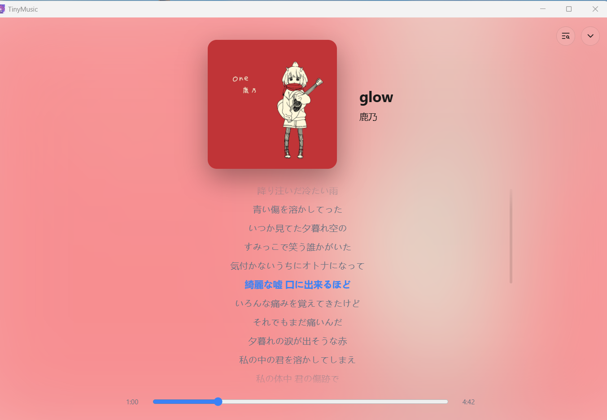

<p align="center">
  
</p>

# TinyMusic

极简、快速、无打扰的**本地桌面音乐播放器**（Windows）。只做"把本地音乐放好、放对"：不做流媒体、不做账号、不做社交。

Tauri 2 + Vue 3 + Rust 构建；数据全部存本地 SQLite，卸载不残留。

## 界面预览

<p align="center">
  
</p>

<p align="center"><sub>正在播放页：毛玻璃氛围背景 + 卡拉OK逐字歌词（增强型 LRC 字级时间标签）</sub></p>

## 功能特性

### 曲库管理

- 文件夹导入（多目录），自动扫描 + 增量监听：文件新增/删除/改名 5s 内自动同步
- 元数据与内嵌封面解析（MP3 / FLAC / M4A / OGG），坏文件容错跳过、不卡 UI
- 标签编辑写回源文件（lofty）：单曲编辑与多选批量编辑（统一改 艺人/专辑/流派/年份 + 曲号自动重编）
- 重复曲目检测（归一化标题 + 艺人 + 时长 + 大小分组）与回收站清理（源文件可恢复）
- 缺失封面批量刮削向导：逐专辑候选网格，Enter 应用 / Esc 跳过，完成后给成功/跳过/未命中统计

### 在线刮削（手动触发，仅元数据、无在线音源）

- 封面与专辑信息：iTunes Search（**JP 店面优先、US 兜底**，J-Pop 友好）/ Deezer / MusicBrainz 三站点合并检索去重，支持自定义检索词与来源筛选
- 歌词：LRCLIB（同步歌词优先、时长贴近排序），同名 `.lrc` 已存在时一并更新
- 歧义匹配人工确认：返回候选列表，用户选定后落库

### 播放引擎

- 播放模式：顺序 / 单曲循环 / 列表循环 / 随机；重启恢复上次播放曲目与进度
- 播放队列：「下一首播放」/「加入队列」/ 播放全部整表入队 / 拖拽排序 / 清空
- 音质与效率：0.75×–2× 倍速、10 段 EQ（Web Audio）、音频输出设备即时切换（不中断播放）
- 播放统计：最近播放 / 最常播放 / 播放历史

### 歌词

- 内嵌歌词 + 同目录同名 `.lrc` 双通道
- 逐行滚动；增强型 LRC 字级时间标签 `<mm:ss.xx>` 解析，正在播放页卡拉OK逐字高亮，无字级标签自动回退逐行

### 歌单与视图

- 歌曲 / 专辑 / 艺人 / 文件夹 / 收藏视图，封面墙 + 虚拟列表（万首滚动流畅）
- 歌单：新建 / 重命名 / 删除 / 拖拽排序 / M3U8 导入导出
- 智能歌单：规则式（播放次数 / 最近播放 / 流派 / 年份 / 添加时间 + 数量上限），实时生成只读
- 即时搜索（SQLite trigram FTS，Ctrl+F 聚焦）

### 界面与系统集成

- 三区布局（左侧导航 + 内容区 + 底部播放条）
- 迷你悬浮播放器：置顶半透明卡片，**锁定态鼠标完全穿透**（不挡下层窗口操作），可拖动记忆位置、透明度可调
- Windows SMTC 系统媒体浮层 + 媒体键、托盘图标与托盘控制
- 深 / 浅 / 跟随系统主题 + 自定义主题色；中 / 英文界面

## 快捷键

| 键 | 行为 |
|---|---|
| Space | 播放 / 暂停 |
| ← / → | 快退 / 快进 5s |
| Ctrl + ← / → | 上一首 / 下一首 |
| ↑ / ↓ | 音量 ±5% |
| Ctrl + F | 聚焦搜索 |
| L | 收藏当前曲目 |
| M | 静音 |
| 媒体键 | 播放 / 暂停 / 上下曲（全局） |

## 快速开始

环境要求：Windows 10/11（系统自带 WebView2）、[Rust](https://rustup.dev) stable（MSVC 工具链）、Node.js ≥ 20.19

```bash
npm install
npm run tauri dev      # 开发调试
npm run tauri build    # 产出 NSIS 安装包与可执行文件
```

## 开发

```bash
npm run build   # vue-tsc 类型检查 + vite 构建
npm run test    # vitest 单测
npm run lint    # eslint
```

```bash
cd src-tauri
cargo clippy    # Rust lint（CI 基线：零警告）
cargo test      # Rust 单测
```

IPC 绑定经 [tauri-specta](https://github.com/specta-rs/tauri-specta) 从 Rust 命令自动生成到 `src/bindings.ts`，前后端类型同源。

### 换应用图标

```bash
npm install --no-save sharp
node scripts/icon-round.mjs <源图> <主图.png>       # 生成 1024 圆角（22.5%）主图
npx tauri icon <主图.png> -o src-tauri/icons        # 生成全套（之后移除 icons 下 android/ios 目录）
```

## 文档

- [功能设计迭代文档](docs/功能设计迭代文档.md)——产品定位、功能地图、交互设计、里程碑验收
- [技术设计文档](docs/技术设计文档.md)——架构分层、IPC 面向、数据模型与修订记录
- [决策记录](docs/决策记录/0001-技术选型-Tauri2+Vue3.md)——ADR

## License

[MIT](LICENSE)
